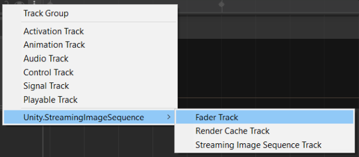
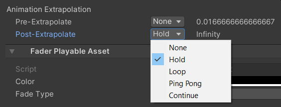
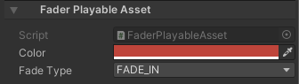

# Fading Image objects

1. [Quick Start](#quick-start)
1. [Gap Extrapolation](#gap-extrapolation)
1. [FaderPlayableAsset](#faderplayableasset)

## Quick Start

From an empty scene, do the following:

1. Create an empty **GameObject** and add a **Director** component to it
1. Copy the sequential images in a folder inside the Unity project, preferably under *StreamingAssets*
   > Copying to a folder under *StreamingAssets* will save us from the process to import those images in Unity, which may take a long time if there are a lot of images
1. Open the Timeline window
1. Add a **FaderTrack** in the Timeline Window

   
   
1. Right click on the timeline window and click *Add Fader Playable Asset*
 
   
   
1. Create an **Image** object by clicking the menu: GameObject -> UI -> Image

1. Drag and drop the **Image** object to the object property of the FaderTrack 

The Image object will be faded in/out as we play the Timeline or drag the time slider of the Timeline window.

## Gap Extrapolation

The behaviour of a gap before or after a clip with FaderPlayableAsset can be set in a similar way to 
[setting gap extrapolation for Animation clips](https://docs.unity3d.com/Packages/com.unity.timeline@1.5/manual/clp_gap_extrap.html)
using one of the following options:
1. **None** (default): hide the bound object by deactivating its **Renderer** component.
1. **Hold**: hold and show the first/last state of the fading in the gap.
1. **Loop**: loop the entire fading with the same clip duration.
1. **Ping Pong**: loop the entire fading backwards, then forwards, and so forth, with the same clip duration.
1. **Continue**: same as **Hold**

By default, FaderPlayableAsset sets both Pre-Extrapolate and Post-Extrapolate properties to **None**.

## FaderPlayableAsset

FaderPlayableAsset is a type of 
[PlayableAsset](https://docs.unity3d.com/ScriptReference/Playables.PlayableAsset.html)
which is used for fading Image component in
[Unity Timeline](https://docs.unity3d.com/Packages/com.unity.timeline@latest).  
We can view or modify the following properties through the inspector.

* **Color**   
  The color to be applied to the Image component attached to the track.
* **Fade Type**  
  - FadeIn : from invisible (alpha=0) to visible   (alpha=1) 
  - FadeOut: from visible   (alpha=1) to invisible (alpha=0) 

