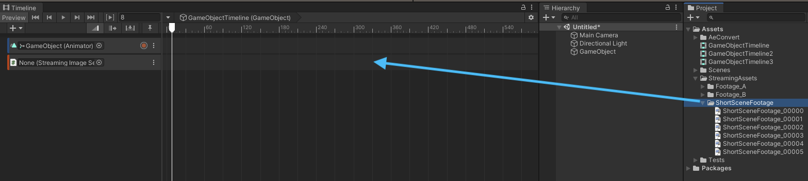
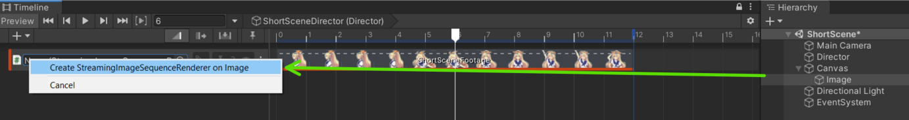
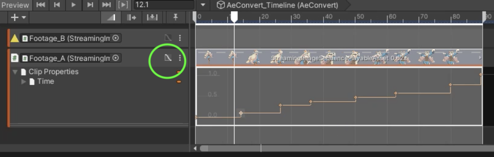

# Playing Sequential Images

1. [Quick Start](#quick-start)
1. [Supported Image Formats](#supported-image-formats)
1. [FrameMarker](#framemarker)
1. [Curve Editing (Editor only)](#curve-editing-editor-only)
1. [StreamingImageSequencePlayableAsset](#streamingimagesequenceplayableasset)

## Quick Start

From an empty scene, do the following:

1. Create an empty **GameObject** and add a **Director** component to it.
1. Copy the sequential images in a folder inside the Unity project, preferably under *StreamingAssets*.
   > Copying to a folder under *StreamingAssets* will save us from the process to import those images in Unity, which may take a long time if there are a lot of images.
1. Open the [Timeline](https://docs.unity3d.com/Packages/com.unity.timeline@latest) window.
1. Add a **StreamingImageSequenceTrack** in the Timeline Window.

   
   
1. Drag and drop the sequential images folder to the **StreamingImageSequenceTrack** added previously. 
   This will automatically create a [StreamingImageSequencePlayableAsset](#streamingimagesequenceplayableasset)
   using the images in the folder.
 
   
   
1. Create an **Image** object by clicking the menu: GameObject > UI > Image.

1. Drag and drop the **Image** object to the object property of the **StreamingImageSequenceTrack**, 
   and click *Create StreamingImageSequenceRenderer on Image*.

   

The image sequences in the folder will then be shown inside the **Image** object, 
and the renderer component of the **Image** object will be played/enabled/disabled 
as we play the Timeline or drag the time slider of the Timeline window.

For other ways for importing images, see [ImportingImages](ImportingImages.md).

## Supported Image Formats

|             | Windows            | Mac                | Linux              |
| ----------- | ------------------ | ------------------ | ------------------ |
| png         | :white_check_mark: | :white_check_mark: | :white_check_mark: |       
| tga         | :white_check_mark: | :white_check_mark: | :white_check_mark: |    

## FrameMarker

Each frame has a [FrameMarker](FrameMarkers.md), 
which can be used to skip the image assigned to that particular frame, 
and show the last used image instead.

Refer to [FrameMarkers](FrameMarkers.md) for more details. 

## Curve Editing (Editor only)

In the editor, we can modify the timing of the playback by 
1. opening the curve section
2. right clicking on the curve to add keys
3. moving the keys accordingly

This is currently only supported in the editor, 
and the playback timing will always be linear in runtime.

## StreamingImageSequencePlayableAsset

StreamingImageSequencePlayableAsset is a type of 
[PlayableAsset](https://docs.unity3d.com/ScriptReference/Playables.PlayableAsset.html)
which is used for playing sequential image sequences in 
[Unity Timeline](https://docs.unity3d.com/Packages/com.unity.timeline@latest).  
We can view or modify the following properties through the inspector.

* **Resolution** (Read Only)  
  Shows the width and height of the first image in the folder
* **Folder**  
  The folder where the image files are located
* **Images**  
  The images inside the folder. 
  Can be reordered by dragging the image file name up/down.
* **Show FrameMarkers**.  
  Show/hide the [FrameMarker](FrameMarkers.md) of each frame.
  * **Reset**  
    Reset edits to FrameMarkers.
* **Background Colors**.  
  * **In Timeline Window**  
    The background color of the preview images in the Timeline window.    
* **Reset Curve**.  
  Reset the curve timing in the PlayableAsset to be linear.

