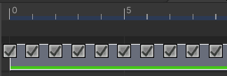
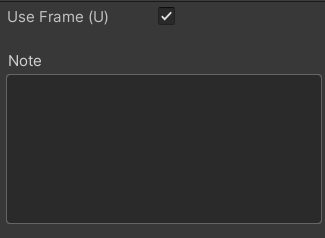

# FrameMarkers

FrameMarkers are markers that appear on top of the playable assets of StreamingImageSequence.
They are used to activate/deactivate per frame processing based on the type of PlayableAsset they belong to.

FrameMarkers are only visible if the Timeline window is zoomed in, and can be activated/deactivated
by selecting and pressing *U* by default. This keyboard shortcut can be changed via the 
[ShortCuts Manager](https://docs.unity3d.com/Manual/UnityHotkeys.html).

# Inspector

* **Use Frame**   
  To activate/deactivate the frame.
* **Note**  
  User notes for the frame.

