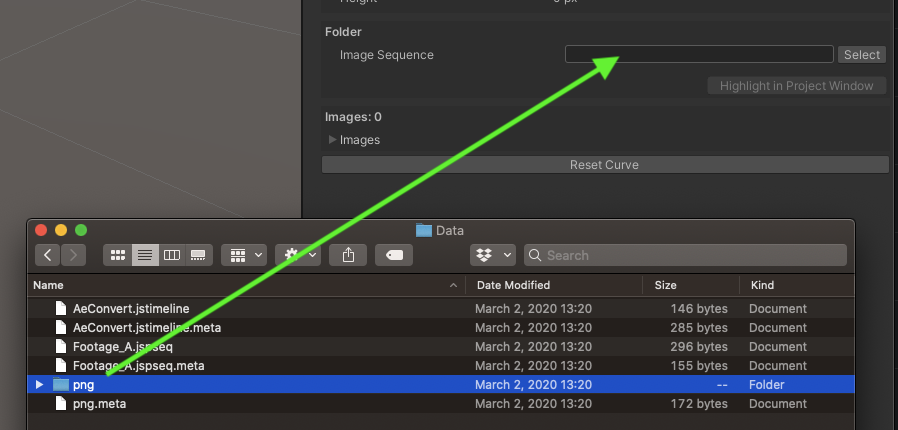
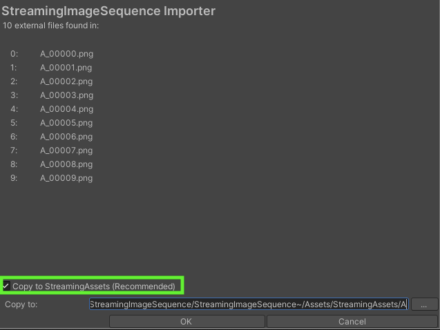

# Importing Images

There are a couple of ways to import images into StreamingImageSequencePlayableAsset

1. [Folder Drag and Drop to the track](#folder-drag-and-drop-to-the-track)
1. [Setting the folder via inspector](#setting-the-folder-via-inspector)
1. [Using StreamingImageSequence script for Adobe After Effects](#using-streamingImageSequence-script-for-adobe-after-effects)

## Folder Drag and Drop to the track

This is done by doing drag and drop of the sequential images folder to the StreamingImageSequenceTrack.

  

## Setting the Folder via Inspector

We can simply click the **Select** button, or we can also drag and drop a folder directly into the inspector.
  

If the chosen folder is not under *StreamingAssets*, then the following import window will appear to confirm if we'd like to copy the images into *StreamingAssets*.   
We can choose to skip copying by unchecking the checkbox to do so.

  

> Copying to *StreamingAssets* is recommended because it saves us from the import process, which may take a long time if there are a lot of images.

## Using StreamingImageSequence script for Adobe After Effects

1. In Adobe After Effects, Run [StreamingImageSequence script for Adobe After Effects](https://github.com/unity3d-jp/StreamingImageSequence/tree/dev/AE~/Plugins) to export the images into a folder.
2. In Unity, click the menu: Assets -> StreamingImageSequence -> Import AE Timeline, and select the *jstimeline* file in the exported folder.

> This import will also create/setup the required Director and Image objects in the Assets/{jstimeline_name} folder.  
Importing a *jstimeline* which has the same file name as a previously imported *jstimeline* will overwrite the existing assets in the folder, 
so it is recommended to move these assets into another folder.
