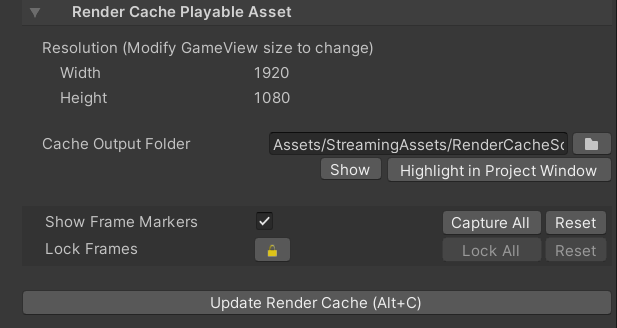

# RenderCachePlayableAsset

A playable asset for caching or saving the render results to image files for playback by 
[StreamingImageSequencePlayableAsset](StreamingImageSequencePlayableAsset.md).

RenderCachePlayableAsset works together with RenderCapturer components, which execute the actual capturing process and
decide what gets written into the image files. Currently, StreamingImageSequence provides: 
1. **CameraRenderCapturer** component.   
   Caches the render result of a Camera component.
1. **BaseRenderCapturer** class.  
   An extensible abstract class, which can be extended to customize the capturing process.

# Tutorial 

From an empty scene, do the following:

1. Create an animation in Timeline, for example: by referring to  

   [Creating Keyframed Animation in Timeline](https://learn.unity.com/tutorial/creating-keyframed-animation-in-timeline) tutorial.

1. Open the Timeline window and add a **RenderCacheTrack**.
 
   
   
1. Right click on the **RenderCacheTrack** and click *Add Render Cache Playable Asset*
 
   
   
1. Create a GameObject and add **CameraRenderCapturer** component.

1. Drag and drop the GameObject to the object property of the **RenderCacheTrack**.

   

1. Select the **RenderCachePlayableAsset** and click *Update Render Cache* in the inspector.

# Inspector

* **Resolution**   
  The resolution of the output images. Modify the gameview size to change this property.
* **Cache Output folder**  
  Where the output images are stored.
* **Show Frame Markers**  
  To customize which frames to capture. These markers are only visible if the Timeline window 
  is zoomed in. 
* **Lock Frames**  
  To prevent certain frames from being rewritten. Useful to maintain custom manipulation to the images.
* **Update Render Cache**
  To update the images by rendering and caching the results as images.

