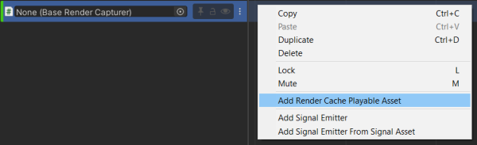
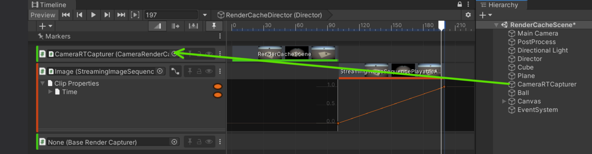

# RenderCachePlayableAsset

A playable asset for caching render results to image files for playback by 
[StreamingImageSequencePlayableAsset](StreamingImageSequencePlayableAsset.md).

RenderCachePlayableAsset works together with RenderCapturer components, which execute the actual capturing process and
decide what gets rendered into image files. Currently, StreamingImageSequence provides: 
1. **CameraRenderCapturer** component.   
   Caches the render result of a Camera component.
1. **BaseRenderCapturer** class.  
   An extensible abstract class, which is used to customize the capturing process.

# Tutorial 

From an empty scene, do the following:

1. Create an animation in Timeline, for example: by referring to
   [Creating Keyframed Animation in Timeline](https://learn.unity.com/tutorial/creating-keyframed-animation-in-timeline) tutorial.

1. Open the Timeline window and add a **RenderCacheTrack**.
 
   
   
1. Right click on the **RenderCacheTrack** and click *Add Render Cache Playable Asset*
 
   

1. Adjust the length of the **RenderCachePlayableAsset** according to the length of the animation.

1. Create a *GameObject* and add *CameraRenderCapturer* component.

1. Drag and drop the GameObject to the object property of the **RenderCacheTrack**.

   

1. Select the **RenderCachePlayableAsset** and click *Update Render Cache* in the inspector.

# FrameMarker

Each frame has a [FrameMarker](FrameMarkers.md), 
which can be used to skip capturing the image for that particular frame, 
and to lock the frame in order to prevent it from being overwritten.

Right clicking on a FrameMarker will bring up a popup menu.
* **Copy**: unused
* **Paste**: unused
* **Duplicate**: unused
* **Delete**: unused
* **Lock and Edit**  
  Lock the frame and open the image using the assigned [image application](https://docs.unity3d.com/Manual/Preferences.html#External-Tools).  
  The default shortcut is *Alt + E* and can be configured via the [ShortCuts Manager](https://docs.unity3d.com/Manual/UnityHotkeys.html).  

Refer to [FrameMarkers](FrameMarkers.md) for more details. 

# Inspector

* **Resolution** (Read Only)  
  The resolution of the output images. Modify the size of the Game window to change this property.
* **Cache Output folder**  
  Where the cached render results are stored.
* **Show Frame Markers**  
  [FrameMarkers](FrameMarkers.md) are used to customize which frames to capture. 
* **Lock Frames**  
  Turn the [FrameMarkers](FrameMarkers.md)'s edit mode to lock mode 
  in order to prevent certain frames 
  from being rewritten, which is useful to maintain custom manipulation 
  to previous cached images.  
  
* **Background Colors**.  
  The background colors of the images.
  * **In Game window (Update)**  
    The background color of the Game window when updating RenderCache.    
  * **In Timeline Window**  
    The background color of the preview images in the Timeline window.    
* **Update Render Cache**  
  Render and cache the results as images.

