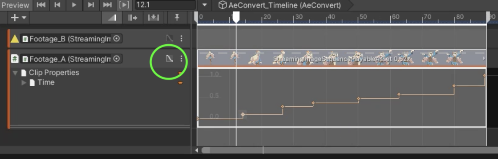

# StreamingImageSequencePlayableAsset

A playable asset for playing sequential image sequences in Unity Timeline.

# Supported Formats

|             | Windows            | Mac                |
| ----------- | ------------------ | ------------------ |
| png         | :white_check_mark: | :white_check_mark: |    
| tga         | :white_check_mark: |                    |

# Tutorial 

From an empty scene, do the following:

1. Create an empty *GameObject* and add a *Director* component to it
1. Copy the sequential images in a folder inside the Unity project, preferably under *StreamingAssets*
   > Copying to a folder under *StreamingAssets* will save us from the process to import those images in Unity, which may take a long time if there are a lot of images
1. Open the Timeline window, if not opened yet
1. Add a StreamingImageSequenceTrack in the Timeline Window

     
   
1. Drag and Drop the sequential images folder to the StreamingImageSequenceTrack added previously
 
     
   
1. Create an Image object by clicking the menu: GameObject -> UI -> Image

1. Drag and drop the Image object to the object property of the StreamingImageSequenceTrack, and click *Create StreamingImageSequenceNativeRenderer on Image* 

     

The image sequences in the folder will then be shown inside the Image object, 
and the Image object will be played/enabled/disabled as we play the Timeline or drag the time slider of the Timeline window.

For other ways for importing images, see [ImportingImages](ImportingImages.md)

# Curve

We can also change the timing of the playback by adjusting the curve of the asset.   
To do this, open the curve section, and right click on the curve to start adding keys.

# Info in Inspector

* **Resolution** (Read Only)  
  Shows the width and height of the first image in the folder
* **Folder**  
  The folder where the image files for this PlayableAsset are located
* **Images**  
  The images inside the folder.
  We can reorder the images by dragging the image file name up/down.
* **Reset Curve**.  
  Reset the curve timing in the PlayableAsset to be linear.

