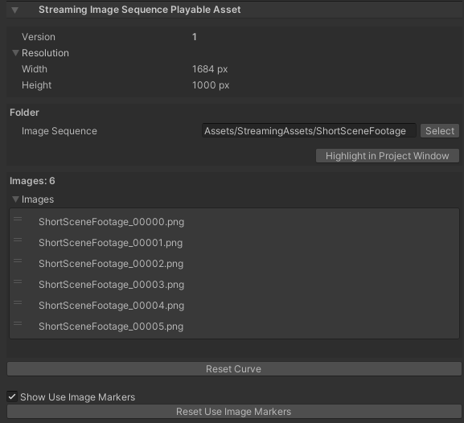

# StreamingImageSequencePlayableAsset

A playable asset for playing sequential image sequences in Unity Timeline.

# Supported Image Formats

|             | Windows            | Mac                |
| ----------- | ------------------ | ------------------ |
| png         | :white_check_mark: | :white_check_mark: |    
| tga         | :white_check_mark: |                    |

# Tutorial 

From an empty scene, do the following:

1. Create an empty *GameObject* and add a *Director* component to it
1. Copy the sequential images in a folder inside the Unity project, preferably under *StreamingAssets*
   > Copying to a folder under *StreamingAssets* will save us from the process to import those images in Unity, which may take a long time if there are a lot of images
1. Open the Timeline window, if not opened yet
1. Add a StreamingImageSequenceTrack in the Timeline Window

   
   
1. Drag and Drop the sequential images folder to the StreamingImageSequenceTrack added previously
 
   
   
1. Create an Image object by clicking the menu: GameObject -> UI -> Image

1. Drag and drop the Image object to the object property of the StreamingImageSequenceTrack, and click *Create StreamingImageSequenceNativeRenderer on Image* 

   

The image sequences in the folder will then be shown inside the Image object, 
and the Image object will be played/enabled/disabled as we play the Timeline or drag the time slider of the Timeline window.

For other ways for importing images, see [ImportingImages](ImportingImages.md)

# Curve

The timing of the playback is determined by the curve of the asset, which can be adjusted by
opening the curve section, right clicking on the curve to add keys, and moving them accordingly.

# UseImageMarker

Each frame has UseImageMarker, which can be used to skip the image assigned to that particular frame, and show the last used image instead.

Keyboard shortcuts:  

1. u: toggle use/skip. This shortcut can be changed in the StreamingImageSequence category in the Shortcuts window.  
1. left/right arrow: move to the prev/next UseImageMarker.

# Inspector

* **Resolution** (Read Only)  
  Shows the width and height of the first image in the folder
* **Folder**  
  The folder where the image files are located
* **Images**  
  The images inside the folder. 
  Can be reordered by dragging the image file name up/down.
* **Reset Curve**.  
  Reset the curve timing in the PlayableAsset to be linear.
* **Show UseImageMarkers**.  
  Show/hide UseImageMarker of each frame.
* **Reset UseImageMarkers**.  
  Reset UseImageMarkers of all frames.

