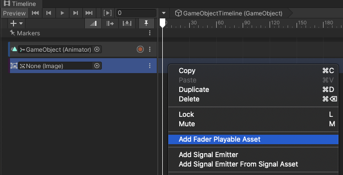

# Image オブジェクトをフェードさせる

1. [クイックスタート](#クイックスタート)
1. [FaderPlayableAsset](#faderplayableasset)

## クイックスタート

空のシーンから、次の手順を実行して下さい。

1. 空の **GameObject** を作成し、**Director** コンポーネントを追加する。
1. Unity プロジェクト内のフォルダー（*StreamingAssets* 配下のフォルダーが推奨されます）内の画像シーケンスをコピーする。
   > *StreamingAssets* 配下のフォルダーにコピーすると、これらの画像を Unity にインポートするプロセスを省くことができます（画像の数が多い場合にはこのインポートプロセスに時間が掛かる場合があります）。
1. Timeline ウィンドウを開く。
1. Timeline ウィンドウ内で、**FaderTrack** を追加する。

   
   
1. Timeline ウィンドウ上で右クリックし「*Add Fader Playable Asset*」をクリックする。
 
   
   
1. メニューを GameObject -> UI -> Image の順にクリックして **Image** オブジェクトを作成する。

1. FaderTrack のオブジェクトプロパティに **Image** オブジェクトをドラッグアンドドロップする。

Timeline を再生したり、Timeline ウィンドウでタイムスライダーをドラッグすると、
Image オブジェクトがフェードイン／フェードアウトします。

## FaderPlayableAsset

FaderPlayableAsset は、
[Unity Timeline](https://docs.unity3d.com/Packages/com.unity.timeline@latest) で
Image コンポーネントをフェードさせるための
[PlayableAsset](https://docs.unity3d.com/ScriptReference/Playables.PlayableAsset.html) です。  
インスペクターで下記のプロパティを確認または変更することができます。

* **Color**   
  トラックに添付された Image コンポーネントに適用される色です。
* **Fade Type**
  - FadeIn: 見えない状態（alpha=0）から見える状態（alpha=1）へのフェードです。
  - FadeOut: 見える状態（alpha=1）から見えない状態（alpha=0）へのフェードです。

