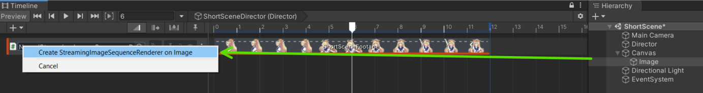
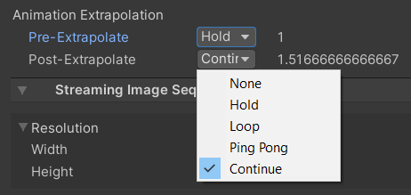
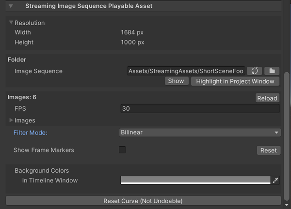

# 連番画像を再生する

1. [クイックスタート](#クイックスタート)
1. [サポートされている画像形式](#サポートされている画像形式)
1. [フォルダーのトレードオフ](#フォルダーのトレードオフ)
1. [フレームマーカー](#フレームマーカー)
1. [ギャップの外挿](#ギャップの外挿)
1. [曲線の編集](#曲線の編集)
1. [StreamingImageSequencePlayableAsset](#streamingimagesequenceplayableasset)

## クイックスタート

空のシーンから、次の手順を実行して下さい。

1. 空の **GameObject** を作成し、**Director** コンポーネントを追加する。
1. Unity プロジェクト内のフォルダー（*StreamingAssets* 配下のフォルダーが推奨されます）内の画像シーケンスをコピーする。
   > *StreamingAssets* 配下のフォルダーにコピーすると、これらの画像を Unity にインポートするプロセスを省くことができます（画像の数が多い場合にはこのインポートプロセスに時間が掛かる場合があります）。
1. [Timeline](https://docs.unity3d.com/Packages/com.unity.timeline@latest) 
   ウィンドウを開く。
1. Timeline ウィンドウに **StreamingImageSequenceTrack** を追加する。

   
   
1. 追加した **StreamingImageSequenceTrack** に画像シーケンスの入ったフォルダーをドラッグアンドドロップする。
   これにより、フォルダー内の画像を使った 
   [StreamingImageSequencePlayableAsset](#streamingimagesequenceplayableasset) が自動的に生成されます。
 
   
   
1. メニューを GameObject > UI > Image の順にクリックして **Image** オブジェクトを作成する。

1. 作成した **Image** オブジェクトを、**StreamingImageSequenceTrack** のオブジェクトプロパティーにドラッグアンドドロップし
   *Create StreamingImageSequenceRenderer on Image* をクリックする。

   

フォルダー内の画像シーケンスが **Image** オブジェクトの中に表示されます。
Timeline を再生したり、Timeline ウィンドウのタイムスライダーをドラッグすると、
**Image** オブジェクトの **Renderer** コンポネントが更新されます。

画像をインポートする他の方法については、
[画像をインポート](ImportingImages.md) を参照してください。

## サポートされている画像形式

|             | Windows            | Mac                | Linux              |
| ----------- | ------------------ | ------------------ | ------------------ |
| png         | :white_check_mark: | :white_check_mark: | :white_check_mark: |       
| tga         | :white_check_mark: | :white_check_mark: | :white_check_mark: |    

## フォルダーのトレードオフ

[StreamingImageSequencePlayableAsset](#streamingimagesequenceplayableasset) の動作は、
画像が保存されているフォルダーによって異なります。  
詳細については、次の表を参照してください。

|                                           | Unity プロジェクトの外                                   | Assetsの下で、StreamingAssets の外                      | StreamingAssets の下|
| ---------------------------------------   | ------------------------------------------------------- | ------------------------------------------------------ | ------------------ |
| テクスチャのインポートに必要な時間           | なし                                                    | テクスチャサイズとテクスチャインポーターの設定によって異なる | なし |       
| テクスチャのクオリティ                      | RGBA 32 ビット、POT スケールなし                         | テクスチャサイズとテクスチャインポーターの設定によって異なる | RGBA 32 ビット、POT スケールなし |    
| CPU から GPU へのテクスチャアップロードコスト | アクティブのテクスチャが変更されるたび                    | なし                                                   | アクティブのテクスチャが変更されるたび |    
| Editor でのテクスチャの CPU メモリの使用量   | [エディタでのメモリ使用量](#エディタでのメモリ使用量)を参照 | なし                                                   | [エディタでのメモリ使用量](#エディタでのメモリ使用量)を参照 |    
| Runtimeでのテクスチャの CPU メモリの使用量   | ランタイムのサポートなし                   　             | ランタイムのサポートなし                                 | 数フレーム後までのテクスチャがプリロードされる |    

### エディタでのメモリ使用量

画像フォルダが該当する場合、StreamingImageSequence は、スムーズな画像再生を提供するために、
エディタで物理メモリを確保し、可能な限りテクスチャをプリロードします。  

この確保は、次の要件を満たすように設定されています:
1. システムの物理メモリの合計の 90％ を超えない。
1. [環境設定](Preferences.md)で設定できるメモリの最大量を超えない。

## フレームマーカー

すべてのフレームが [フレームマーカー](FrameMarkers.md) を持っています。
これは特定のフレームに割り当てられた画像をスキップし、
そのフレームの直前に使われた画像を代わりに表示するために使います。

詳細に関しては[フレームマーカー](FrameMarkers.md)を参照してください。

## ギャップの外挿

StreamingImageSequencePlayableAsset クリップの前後のギャップの動作は、
[Animation クリップのギャップの外挿の設定](https://docs.unity3d.com/ja/Packages/com.unity.timeline@1.5/manual/clp_gap_extrap.html)のと同様、
下記のオプションで設定できます：
1. **None** (デフォルト): **Renderer** コンポーネントを非アクティブにし、バインドされたオブジェクトを非表示にする。
1. **Hold**: ギャップ内に連番の最初、または最後のフレームを表示し続ける。
1. **Loop**: 同じクリップの長さで、連番をループする。
1. **Ping Pong**: 同じクリップの長さで、連番を逆方向にループし、次に順方向にループする。
1. **Continue**: **Hold** と同じ。

デフォルトとして、StreamingImageSequencePlayableAsset は Pre-Extrapolate と Post-Extrapolate プロパティの両方を **None** 
に設定します。

## 曲線の編集

エディターでは、再生のタイミングを次のように変更できます。
1. 曲線のセクションを開く
2. 曲線を右クリックして、キーを追加する
3. 追加されたキーを動かす  

## StreamingImageSequencePlayableAsset

StreamingImageSequencePlayableAsset は、
[Unity Timeline](https://docs.unity3d.com/Packages/com.unity.timeline@latest) で
連番画像を再生する為に使われる
[PlayableAsset](https://docs.unity3d.com/ScriptReference/Playables.PlayableAsset.html) です。  
インスペクターで下記のプロパティを確認または変更することができます。

* **Resolution**（読み取り専用）  
  フォルダー内の最初の画像の幅と高さを表示します。
* **Folder**  
  画像ファイルが入っているフォルダーです。
* **Images**  
  フォルダー内の画像です。
  画像ファイルの名前を上下にドラッグアンドドロップして並び替えることができます。
* **Show FrameMarkers**  
  各フレームのフレームマーカーの表示・非表示を切り替えます。
  * **Reset**  
    フレームマーカーの編集をリセットします。
* **Background Colors**.  
  * **In Timeline Window**  
    Timeline ウィンドウのプレビュー画像の背景色。

* **Reset Curve**。
  プレイアブルアセット内の曲線のタイミングをリニアにリセットします。

