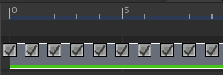
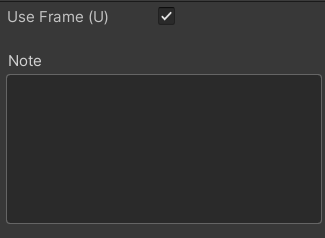

# フレームマーカー

フレームマーカーは StreamingImageSequence のプレイアブルアセットの上に表示されるマーカーで、
タイムラインウィンドウが拡大されている場合にのみ表示されます。
マーカーが属する プレイアブルアセットのタイプによって、
フレーム毎の処理をオン・オフすることができます。

キーボードショートカット：  
1. u: オン・オフ。このショートカットは、
[ShortCuts Manager](https://docs.unity3d.com/ja/current/Manual/UnityHotkeys.html)
で変更できます。

1. 左/右の矢印キー：直前（左の矢印キー）または直後（右の矢印キー）のフレームマーカーに移動します。

> フレームマーカーが正しく表示されていない場合は、ヒエラルキーウィンドウの PlayableDirector ゲームオブジェクトをクリックし、
> タイムラインウィンドウをリフレッシュしてください。

# インスペクター

* **Use Frame**   
  フレームの処理をオン・オフする。
* **Note**  
  フレームのユーザーのメモ。

