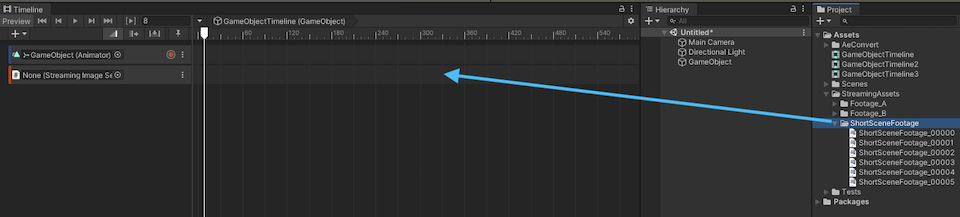
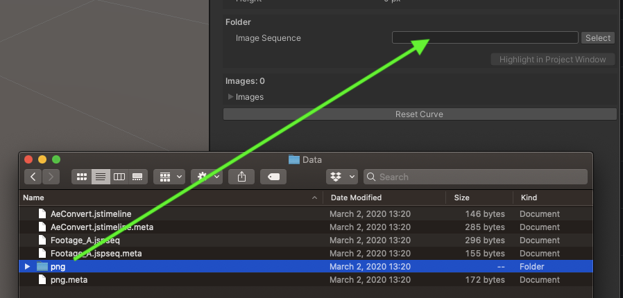
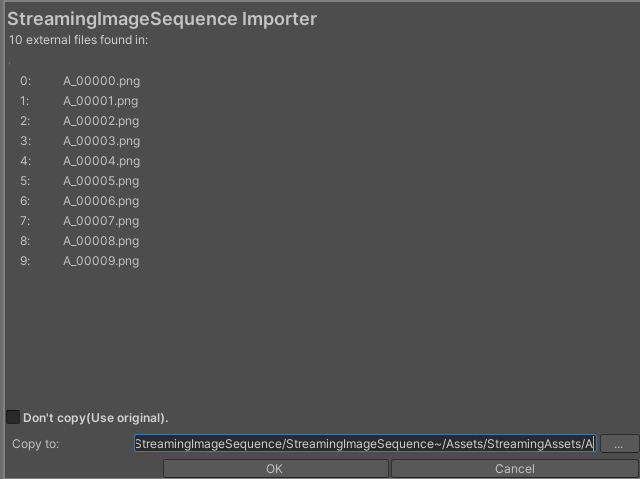

# 画像をインポートする

画像を StreamingImageSequencePlayableAsset 内にインポートする方法はいくつかあります。

1. [フォルダーをトラックにドラッグアンドドロップする](#folder-drag-and-drop-to-the-track)
1. [インスペクターでフォルダーを設定する](#setting-the-folder-via-inspector)
1. [Adobe After Effects で StreamingImageSequence スクリプトを使用する](#using-streamingImageSequence-script-for-adobe-after-effects)

## フォルダーをトラックにドラッグアンドドロップする

画像シーケンスの入ったフォルダーを StreamingImageSequenceTrack にドラッグアンドドロップします。

## インスペクターでフォルダーを設定する

**Select** ボタンをクリックするか、フォルダーを直接インスペクター内にドラッグアンドドロップしてください。

選択されたフォルダーが *StreamingAssets* の配下にない場合、以下のインポートウィンドウが表示され、画像を *StreamingAssets* 内にコピーするかどうか確認されます。   
チェックボックスをオフにすると、コピーをスキップできます。

> *StreamingAssets* にコピーすれば（画像の数が多い場合は時間が掛かる可能性がある）インポートのプロセスが省略されるので、これをお勧めします。

## Adobe After Effects 用の StreamingImageSequence スクリプトを使用する

1. Adobe After Effects 内で、[Adobe After Effects 用の StreamingImageSequence スクリプト](https://github.com/unity3d-jp/StreamingImageSequence/tree/dev/AE~/Plugins)を実行し、画像をフォルダー内にエクスポートしてください。
2. Unity で、メニューを Assets -> StreamingImageSequence -> Import AE Timeline の順にクリックし、エクスポートされたフォルダー内の *jstimeline* ファイルを選択してください。

> このインポートを行うと、必要な Director オブジェクトと Image オブジェクトが Assets/{jstimeline_name} フォルダー内に作成／設定されます。  
以前にインポートされた *jstimeline* と同じファイル名を持つ *jstimeline* をインポートすると、フォルダー内の既存のアセットが上書きされるので、
これらのアセットを別のフォルダーに移動させることをお勧めします。
