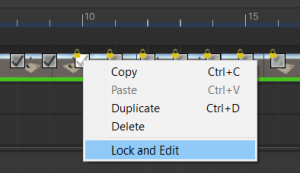

# RenderCachePlayableAsset

描画の結果を、キャッシュとして画像ファイルに書き込む為のプレイアブルアセットです。
この描画のキャッシュを [StreamingImageSequencePlayableAsset](StreamingImageSequencePlayableAsset.md)
で再生することができます。

RenderCachePlayableAsset は RenderCapturer コンポネントと連携しています。
RenderCapturer は実際のキャプチャと画像ファイルへの描画を担当し、
現在 StreamingImageSequence は下記のスクリプトを提供します。
1. **CameraRenderCapturer** コンポネント   
   Camera コンポネントの描画の結果のキャッシュを生成する。
1. **BaseRenderCapturer** クラス。  
   拡張可能のアブストラクトクラス。
   キャプチャなどのプロセスをカストマイズするためのクラスです。

# チュートリアル

空のシーンから以下を行ってください。

1. Timeline 上で、アニメーションを作成する。例：
   [Creating Keyframed Animation in Timeline](https://learn.unity.com/tutorial/creating-keyframed-animation-in-timeline)
   を参照。

1. Timeline ウィンドウを開き、**RenderCacheTrack** を追加する。

   
   
1. **RenderCacheTrack** 上に右クリックし、*Add Render Cache Playable Asset* をクリックす。
 
   

1. **RenderCachePlayableAsset** の長さをアニメーションと同じように調整する。

1. *GameObject* を作成し、*CameraRenderCapturer* コンポネントを追加する。

1. 追加した **RenderCacheTrack** のオブジェクトプロパティに GameObject をドラッグアンドドロップする。

   

1. **RenderCachePlayableAsset** を選択し、Inspector 上に *Update Render Cache* をクリックする。

# フレームマーカー

すべてのフレームが [フレームマーカー](FrameMarkers.md) を持っています。
これは特定のフレームのキャプチャをスキップする、
あるいは画像ファイルが上書きされないようにフレームをロックするために使います。

フレームマーカーを右クリックしたら、ポップアップメニューが開かれます。
* **Copy**：未使用
* **Paste**：未使用
* **Duplicate**：未使用
* **Delete**：未使用
* **Lock and Edit**  
  フレームをロックし、アサインされた [image application](https://docs.unity3d.com/ja/current/Manual/Preferences.html#External-Tools) でフレームを開きます。  
  デフォルトのショートカットは *Alt + E* で [ShortCuts Manager](https://docs.unity3d.com/ja/current/Manual/UnityHotkeys.html)
  で変更できます。

詳細に関しては[フレームマーカー](FrameMarkers.md)を参照してください。

# インスペクター

* **Resolution**（読み取り専用）  
  出力される画像の解像度。このプロパティを変更するために、Game ウィンドウのサイズを変更します。
* **Cache Output folder**  
  描画の結果のキャッシュを保存するための場所。
* **Show Frame Markers**  
  キャプチャされるフレームを指定するための[フレームマーカ](FrameMarkers.md)。 
* **Lock Frames**  
  フレームが上書きされないよう、[フレームマーカ](FrameMarkers.md) の編集モードをロックモードに切り替えます。
  既存のユーザー編集などを維持するために使用できます。

* **Update Render Cache**  
  描画を実行し、キャッシュとしてその結果を画像ファイルに書き込みます。

