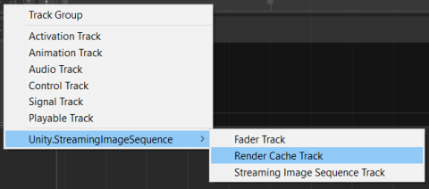
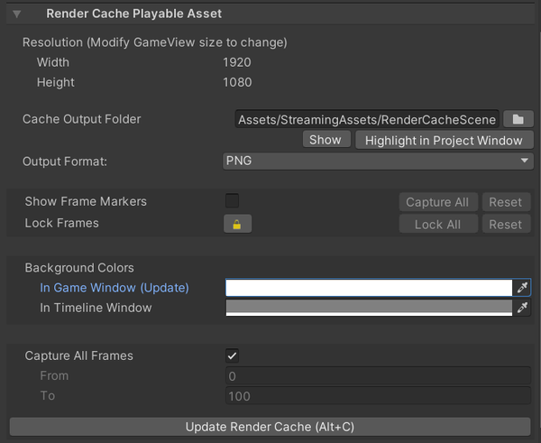

# RenderCachePlayableAsset

描画の結果を画像ファイルに書き込む為のプレイアブルアセットです。
この描画のキャッシュを [StreamingImageSequencePlayableAsset](StreamingImageSequencePlayableAsset.md)
で再生することができます。

RenderCachePlayableAsset は 実際のキャプチャと画像ファイルに描画する 
RenderCapturer コンポネントと連携しています。
この用途で、現在 StreamingImageSequence は下記のスクリプトを提供します。
1. **CameraRenderCapturer** コンポネント   
   Camera コンポネントの描画の結果のキャッシュを生成する。
1. **BaseRenderCapturer** クラス。  
   拡張可能のアブストラクトクラス。
   キャプチャなどのプロセスをカストマイズするために、拡張できます。

# チュートリアル

空のシーンから以下を行ってください。

1. Timeline 上で、アニメーションを作成する。例：
   [Creating Keyframed Animation in Timeline](https://learn.unity.com/tutorial/creating-keyframed-animation-in-timeline)
   を参照。

1. Timeline ウィンドウを開き **RenderCacheTrack** を追加する。

   
   
1. **RenderCacheTrack** 上に右クリックし、*Add Render Cache Playable Asset* をクリックす。
 
   
   
1. GameObject を作成し、**CameraRenderCapturer** コンポネントを追加する。

1. 追加した **RenderCacheTrack** のオブジェクトプロパティに GameObject をドラッグアンドドロップする。

   

1. **RenderCachePlayableAsset** を選択し、Inspector 上に *Update Render Cache* をクリックする。

# インスペクター

* **Resolution**   
  出力される画像の解像度。このプロパティを変更するために、Game ウィンドウのサイズを変更します。
* **Cache Output folder**  
  描画の結果のキャッシュを保存するための場所。
* **Show Frame Markers**  
  キャプチャされるフレームを指定するための [フレームマーカ](FrameMarkers.md)。 
* **Lock Frames**  
  フレームが上書きされないよう、[フレームマーカ](FrameMarkers.md) をロックモードに切り替えます。
  ユーザー編集などを保持するために使用できます。

* **Update Render Cache**  
  描画を実行し、キャッシュとしてその結果を画像ファイルに書き込みます。

