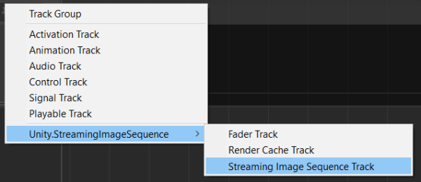

# StreamingImageSequencePlayableAsset

一連の画像シーケンスを Unity Timeline で再生するためのプレイアブルアセットです。

# 対応の画像形式

|             | Windows            | Mac                | Linux              |
| ----------- | ------------------ | ------------------ | ------------------ |
| png         | :white_check_mark: | :white_check_mark: | :white_check_mark: |       
| tga         | :white_check_mark: | :white_check_mark: | :white_check_mark: |    

# チュートリアル

空のシーンから以下を行ってください。

1. 空の *GameObject* を作成し、*Director* コンポーネントを追加してください。
1. Unity プロジェクト内のフォルダー（*StreamingAssets* 配下のフォルダーが推奨されます）内の画像シーケンスをコピーしてください。
   > *StreamingAssets* 配下のフォルダーにコピーすると、これらの画像を Unity にインポートするプロセスを省くことができます（画像の数が多い場合にはこのインポートプロセスに時間が掛かる場合があります）。
1. Timeline ウィンドウが開かれていない場合は、これを開いてください。
1. Timeline ウィンドウに **StreamingImageSequenceTrack** を追加してください。

   
   
1. 追加した **StreamingImageSequenceTrack** に画像シーケンスの入ったフォルダーをドラッグアンドドロップしてください。
 
   
   
1. メニューを GameObject > UI > Image の順にクリックして *Image* オブジェクトを作成してください。

1. 作成した *Image* オブジェクトを、**StreamingImageSequenceTrack** のオブジェクトプロパティーにドラッグアンドドロップし
   *Create StreamingImageSequenceRenderer on Image* をクリックしてください。

   

フォルダー内の画像シーケンスが *Image* オブジェクトの中に表示されます。
Timeline を再生したり、Timeline ウィンドウのタイムスライダーをドラッグすると、
*Image* オブジェクトの *Renderer* コンポネントが再生、有効化、または無効化されます。

画像をインポートする他の方法については、
[画像をインポート](ImportingImages.md) を参照してください。

# 曲線

プレイバックのタイミングはアセットの曲線によって決まります。
これは曲線のセクションを開いて曲線の上で右クリックしてキーを追加し、
追加したキーを動かすことで調節することができます。

# フレームマーカー

すべてのフレームが [フレームマーカー](FrameMarkers.md) を持っています。
これは特定のフレームに割り当てられた画像をスキップし、
そのフレームの直前に使われた画像を代わりに表示するために使います。

詳細に関しては[フレームマーカー](FrameMarkers.md)を参照してください。

# インスペクター

* **Resolution**（読み取り専用）  
  フォルダー内の最初の画像の幅と高さを表示します。
* **Folder**  
  画像ファイルが入っているフォルダーです。
* **Images**  
  フォルダー内の画像です。
  画像ファイルの名前を上下にドラッグアンドドロップして並び替えることができます。
* **Show FrameMarkers**  
  各フレームのフレームマーカーの表示・非表示を切り替えます。
  * **Reset**  
    フレームマーカーの編集をリセットします。
* **Background Colors**.  
  * **In Timeline Window**  
    Timeline ウィンドウのプレビュー画像の背景色。

* **Reset Curve**。
  プレイアブルアセット内の曲線のタイミングをリニアにリセットします。

