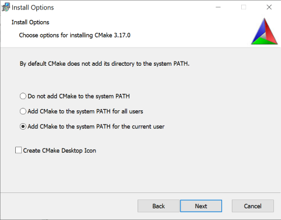

# Building Plugins

1. [Windows](#building-on-windows)
1. [Mac OSX](#building-on-mac-osx)
1. [Running Unit Tests](#running-unit-tests)


## Building on Windows

### Prerequisites (Win)

1. Install [cmake](https://cmake.org/)  version 3.15 or later.  
   Make sure to choose one of the "Add CMake to the System PATH ..." options as shown below.  
   
   
1. Install Visual Studio 2019.
1. Install git. For example: [SourceTree](https://www.sourcetreeapp.com/)
    

### Build Steps (Win)


Start "Developer Command Prompt for VS 2019" and execute the following:

    ``` 
    $ git clone https://github.com/unity3d-jp/StreamingImageSequence.git
    $ cd StreamingImageSequence\Plugins~\Build 
    $ cmake -G "Visual Studio 16 2019" -A x64 ..
    $ msbuild StreamingImageSequencePlugin.sln /t:Build /p:Configuration=Release /p:Platform=x64 /m /nologo
    ```  

> For a regular "Command Prompt", there is a script: *VsDevCmd_2019.bat* 
> under the *Build* folder, which if executed, will turn the prompt into a 
> "Developer Command Prompt for VS 2019".


## Building on Mac OSX

### Prerequisites (Mac)

1. Install [cmake](https://cmake.org/)  version 3.15 or later, if not already installed.
1. Install [XCode](https://developer.apple.com/xcode/).
1. Install XCode Command Line tools.
    ``` 
    xcode-select --install
    ```  
1. Install git. For example: [SourceTree](https://www.sourcetreeapp.com/)


### Build Steps (Mac)

Open a terminal and execute the following

``` 
$ git clone https://github.com/unity3d-jp/StreamingImageSequence.git
$ cd StreamingImageSequence/Plugins~/Build 
$ cmake -GXcode ..
$ xcodebuild -scheme ALL_BUILD -configuration Release build
```

## Running Unit Tests

### Windows 

1. Download [GoogleTest](https://github.com/google/googletest/releases)
1. Starting "Developer Command Prompt for VS 2019" **as administrator** 
3. Execute the following inside the GoogleTest source directory.
    ``` 
    $ mkdir Build
    $ cd Build
    $ cmake .. 
    $ msbuild googletest-distribution.sln /t:Build /p:Configuration=Debug /p:Platform=x64 /m /nologo
    $ msbuild googletest-distribution.sln /t:Build /p:Configuration=Release /p:Platform=x64 /m /nologo
    $ cmake -DBUILD_TYPE=Release -P cmake_install.cmake
    ```
1. Add *GTEST_ROOT* environment variable to point to where GoogleTest was installed.
1. Go inside the plugin folder of StreamingImageSequence and execute the following:
    ``` 
    $ cd StreamingImageSequence\Plugins~\Build 
    $ cmake -G "Visual Studio 16 2019" -A x64 .. -DBUILD_UNIT_TESTS=ON
    $ msbuild StreamingImageSequencePlugin.sln /t:Build /p:Configuration=Release /p:Platform=x64 /m /nologo
    $ ctest -C Release
    ```


