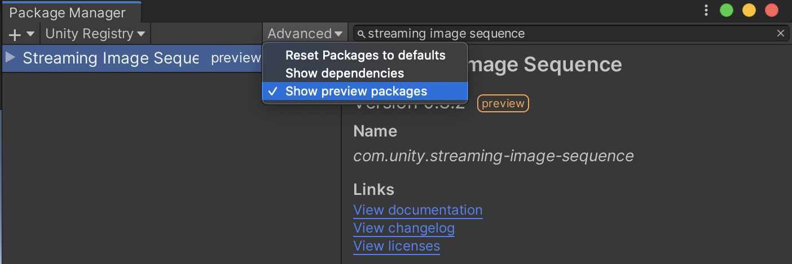
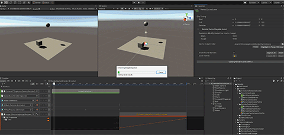

## Other Languages
* [日本語](README_JP.md)

# Streaming Image Sequence

Streaming Image Sequence is a package for playing sequential image sequences in 
Unity Timeline easily without making Unity 2D Sprites.  

**Using Timeline 1.4.x or above is recommended.**

Streaming Image Sequence is designed with the following principles in mind:

1. Can avoid texture importing time entirely by using 
   [StreamingAssets](https://docs.unity3d.com/Manual/StreamingAssets.html).
1. Offers smooth image playback, both in play mode and in timeline editing mode.
1. Supports multiple OS.

Streaming Image Sequence is currently a preview package and the steps to install it 
differ based on the version of Unity.

* Unity 2019.x  
  
  1. Open [Package Manager](https://docs.unity3d.com/Manual/upm-ui.html) 
  2. Ensure that **Show preview packages** is checked. 
  3. Search for *Streaming Image Sequence*.
  
* Unity 2020.1  
  
  1. Open [Package Manager](https://docs.unity3d.com/Manual/upm-ui.html) 
  2. Click the **+** button, and choose **Add package from git URL** 
  3. Type in `com.unity.streaming-image-sequence@` followed by the version.  
     For example: `com.unity.streaming-image-sequence@0.3.2-preview`
  
## Supported Platforms

1. Windows
2. Mac

## Features

1. ##### [Playing Sequential Images](./Documentation~/en/StreamingImageSequencePlayableAsset.md)

   

2. ##### [Caching Render Results](./Documentation~/en/RenderCachePlayableAsset.md)

   

3. ##### [Fading Image objects](./Documentation~/en/FaderPlayableAsset.md)

   

## Memory

StreamingImageSequence allocates physical memory to ensure smooth image playback.  
This allocation is set to satisfy the following requirements:
1. Does not exceed 90% of the total physical memory of the system.
2. Does not exceed the maximum amount of memory, which can be configured on the
**Edit > Preferences** window.

| Legend  | Use                                                                                       | 
| ------- | ---------------------------------------------------------------------- | 
| A       | Preferences to configure                                               |   
| B       | Currently applied values                                               |   
| C       | Apply and save                                                         |  

## Plugins
* [Building](Plugins~/Docs/en/BuildPlugins.md)

## License
* Source Code: [Unity Companion License](LICENSE.md)
* Third-Party Software Components: [Third Party Notices](Third%20Party%20Notices.md)
* Unity-chan Assets: [Unity-Chan License](http://unity-chan.com/contents/guideline_en/)  
  These assets can be located under, but not limited to, the following folder:
  - `AE~/Samples`
  - `StreamingImageSequence~/Assets/StreamingAssets`  

# Tutorial Videos
* [Usage Video](https://youtu.be/mlRbwqJ74CM)
* [Example](https://youtu.be/4og6rgQdb3c)

