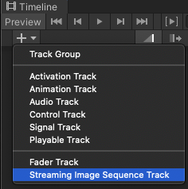
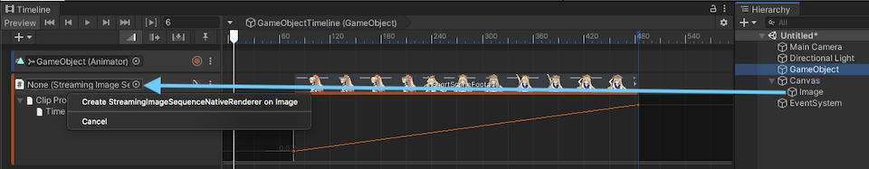
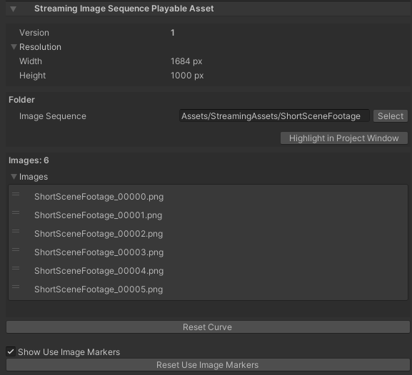

# Streaming Image Sequence

Streaming Image Sequence is a package for playing sequential image sequences in Unity Timeline 
easily without making Unity 2D Sprites. 

# Supported Platforms

1. Windows
2. Mac

# Basic Usage 

1. Create an empty *GameObject* and add a *Director* component to it
1. Copy the sequential images in a folder under *StreamingAssets*
1. Open the Timeline window, if not opened yet
1. Add a StreamingImageSequenceTrack in the Timeline Window

     
   
1. Drag and Drop the sequential images folder under *StreamingAssets* to the StreamingImageSequenceTrack added previously
 
     
   
1. Create an Image object by clicking the menu: GameObject -> UI -> Image

1. Drag and drop the Image object to the object property of StreamingImageSequenceTrack, and click *Create StreamingImageSequenceNativeRenderer on Image* 

     

1. The image sequences in the folder will then be shown inside the Image object, 
   and the Image object will be played/enabled/disabled as we play the Timeline or drag the time slider of the Timeline window

Drag and drop the Image object to the object property of StreamingImageSequenceTrack, and click *Create StreamingImageSequenceNativeRenderer on Image* 

# StreamingImageSequence PlayableAsset

* **Resolution** (Read Only)  
  Shows the width and height of the first image in the folder
* **Folder**  
  The folder where the image files for this PlayableAsset are located
* **Images**  
  The images inside the folder.
  We can reorder the images by dragging the image file name up/down.
* **Reset Curve**.  
  Reset the curve timing in the PlayableAsset to be linear.

## License
* Source Code: [Unity Companion License](LICENSE.md)
* Unity-chan Assets: [Unity-Chan License](http://unity-chan.com/contents/guideline_en/).
  Unity
  Unity-chan Assets are located under the following folder:
  - `AE~/Samples`
  - `StreamingImageSequence~/Assets/StreamingAssets`  

## Tutorial Videos
- [Usage Video](https://youtu.be/mlRbwqJ74CM)
- [Example](https://youtu.be/4og6rgQdb3c)
