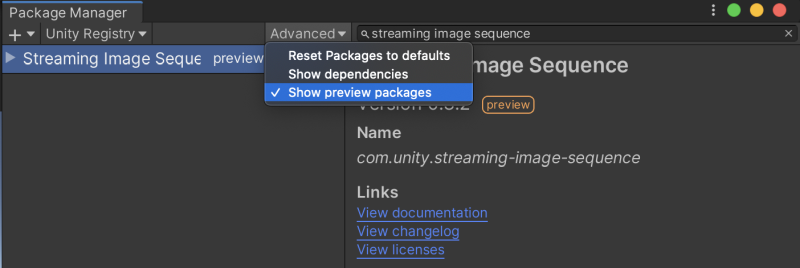

## その他の言語
* [English](README.md)

# Streaming Image Sequence

 

Streaming Image Sequence は、Unity 2D Sprite を作成せずに Unity の Timeline 
で連番画像を簡単に再生するためのパッケージです。

**Timeline 1.4.x 以降のご利用を推奨いたします。**

Streaming Image Sequence は下記の要件を満たすように設計されています。

1. [StreamingAssets](https://docs.unity3d.com/ja/current/Manual/StreamingAssets.html) 
   を使用することで、完全にテクスチャのインポート時間を回避できます。
1. 再生モードとタイムライン編集モードの両方で、スムーズに画像を再生できます。   
1. 複数のOSをサポートします。

Streaming Image Sequence は現在プレビューパッケージとして存在し、
インストールの手順は Unity のバージョンによって少々違います。

* Unity 2019.x  
  
  1. [パッケージマネージャー](https://docs.unity3d.com/ja/current/Manual/upm-ui.html)を開く
  2. **Show preview packages** にチェックが付いているかを確認する
  3. *Streaming Image Sequence*　を検索する
  
* Unity 2020.1  
  
  1. [パッケージマネージャー](https://docs.unity3d.com/ja/current/Manual/upm-ui.html)を開く
  2. **+** ボタンをクリックし、**Add package from git URL** を選択する
  3. `com.unity.streaming-image-sequence@` とそれに続くバージョンを記入する。  
     例：`com.unity.streaming-image-sequence@0.3.2-preview`
  

## 対応プラットフォーム

1. Windows
2. Mac
3. Linux

## 機能

1. #### [連番画像を再生する](./Documentation~/jp/FeaturePlayingSequentialImages.md)

   

2. #### [描画の結果のキャッシュを生成する](./Documentation~/jp/FeatureCachingRenderResults.md)

   

3. #### [Image オブジェクトをフェードさせる](./Documentation~/jp/FeatureFadingImages.md)

   

## プラグイン
* [ビルド](Plugins~/Docs/en/BuildPlugins.md)

## ライセンス
* ソースコード: [Unity Companion License](LICENSE.md)
* サードパーティのソフトウェア　コンポーネント: [Third Party Notices](Third%20Party%20Notices.md) 
* Unity-chan アセット: [Unity-Chan License](https://unity-chan.com/contents/guideline/)  
  このアセットは下記のフォルダーに配置されていますが、これらのみに限定されない。
  - `AE~/Samples`
  - `StreamingImageSequence~/Assets/StreamingAssets`

## チュートリアル動画
- [使用方法を示した動画](https://youtu.be/mlRbwqJ74CM)
- [サンプル](https://youtu.be/4og6rgQdb3c)

